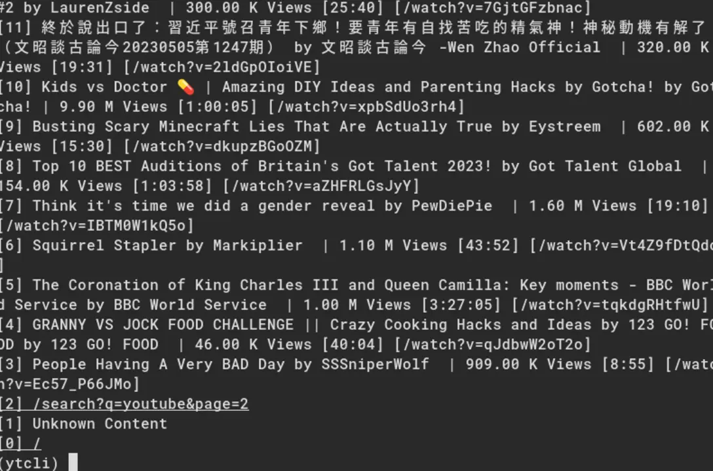

A simple command line tool written in Rust that let's you browse YouTube on a command line. Scrapes HTML from Invidious instances.

There are no binaries available, you need to compile your own.

For instructions on how to use this, see the repoistories `README.md` or type `help` while in the `(ytcli)` prompt.

https://github.com/veprogames/ytcli